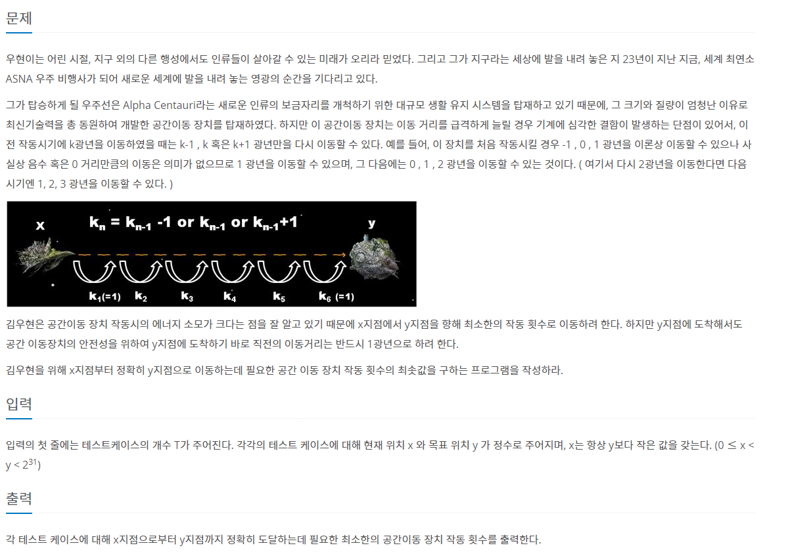

# baekjoon_1011

>


```
'''
3
0 3
1 5
45 50
'''

T = int(input())

for tc in range(1, T + 1):
    x, y = map(int, input().split())

    dis = y - x
    cnt = 0
    if dis <= 3:
        print(dis)

    while True:
        x += s_n
        cnt += 1

        if x == (y - 1):
            cnt += 1
            print(cnt)
            break
        else:
            dis

# 풀다가 일이생겨스,, 다시 풀어본다!
```

